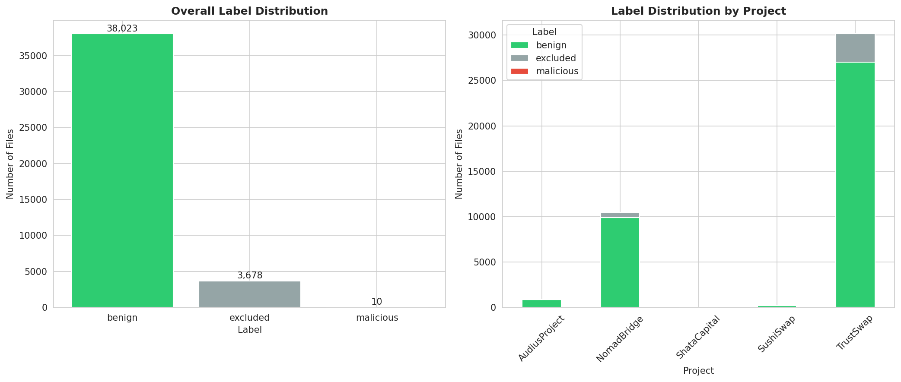
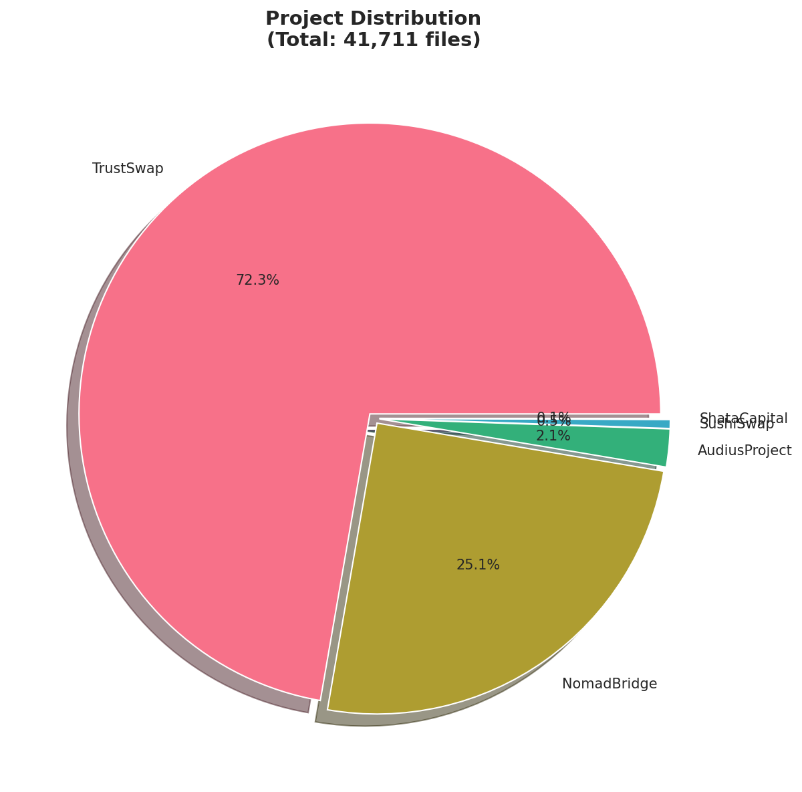
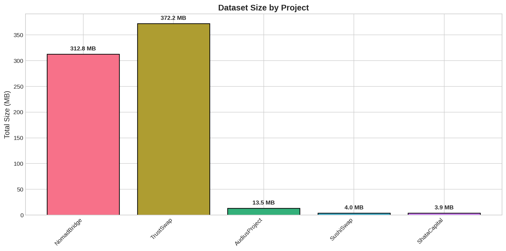
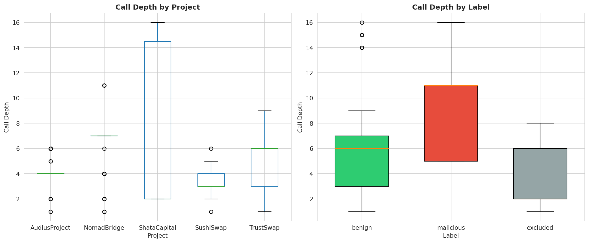
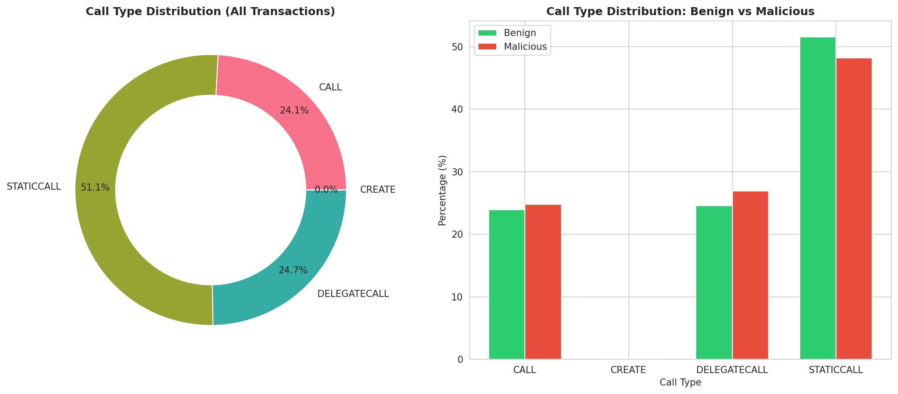
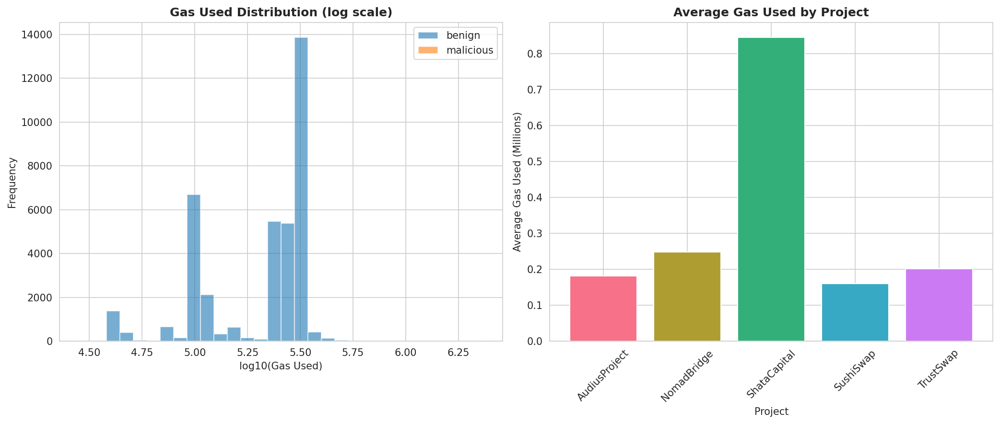
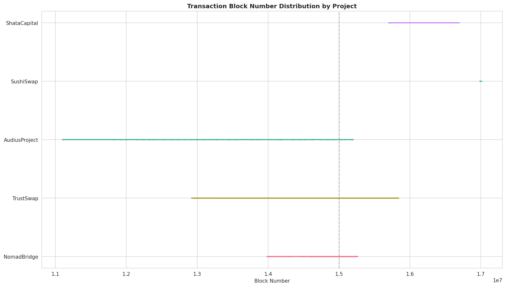
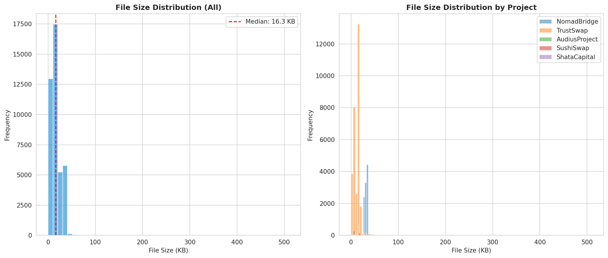
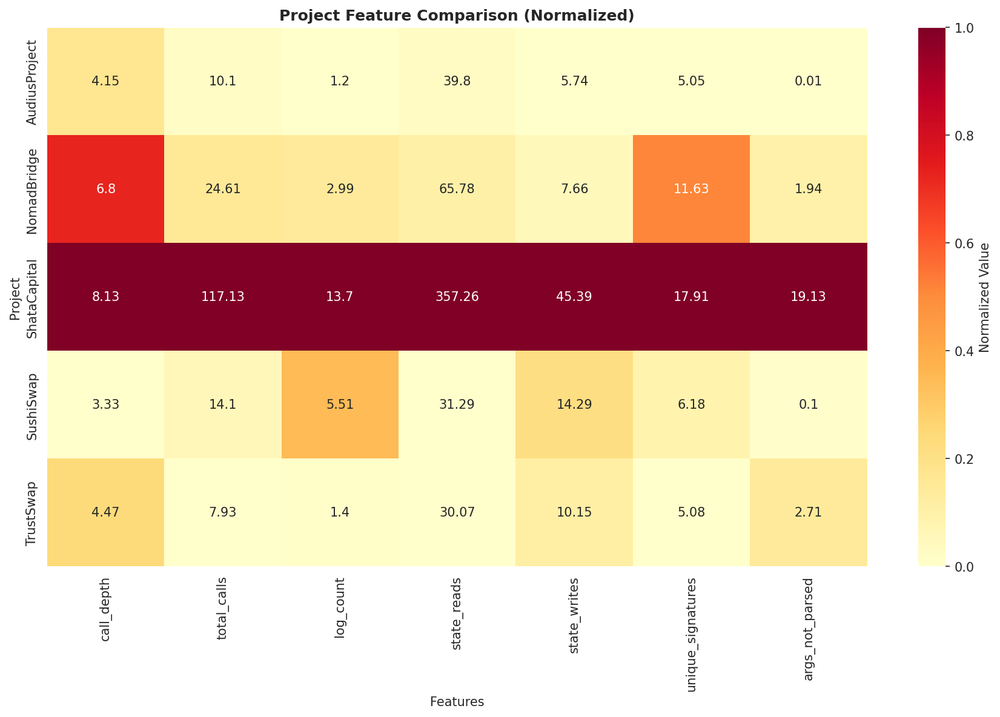

# 데이터셋 통계 분석 결과

## 개요

이 문서는 BlockScan 데이터셋의 정량적 분석 결과를 제공합니다. 분석은 전체 41,711개 파일을 대상으로 수행되었습니다.

---

## 1. 전체 데이터셋 요약

### 1.1 기본 통계

| 항목 | 값 |
|------|-----|
| 총 파일 수 | 41,711 |
| 총 크기 | 706.37 MB |
| 프로젝트 수 | 5 |
| 수집일 | 2024년 1월 26일 |

### 1.2 레이블 분포

| 레이블 | 파일 수 | 비율 |
|--------|--------|------|
| Benign (정상) | 38,023 | 91.15% |
| Malicious (악성) | 10 | 0.02% |
| Excluded (제외) | 3,678 | 8.82% |



---

## 2. 프로젝트별 분석

### 2.1 프로젝트별 데이터 분포

| 프로젝트 | 파일 수 | 크기 (MB) | 비율 |
|---------|--------|----------|------|
| TrustSwap | 30,146 | 372.16 | 72.27% |
| NomadBridge | 10,460 | 312.78 | 25.07% |
| AudiusProject | 876 | 13.51 | 2.10% |
| SushiSwap | 206 | 4.04 | 0.49% |
| ShataCapital | 23 | 3.87 | 0.06% |



### 2.2 프로젝트별 레이블 분포

| 프로젝트 | Benign | Malicious | Excluded |
|---------|--------|-----------|----------|
| NomadBridge | 9,915 | 4 | 541 |
| TrustSwap | 27,024 | 0 | 3,122 |
| AudiusProject | 865 | 2 | 9 |
| SushiSwap | 199 | 2 | 5 |
| ShataCapital | 20 | 2 | 1 |

### 2.3 프로젝트별 크기 비교



---

## 3. 콜 구조 분석

### 3.1 콜 깊이 통계

| 프로젝트 | 평균 깊이 | 최대 깊이 |
|---------|----------|----------|
| ShataCapital | 8.13 | 16 |
| NomadBridge | 6.80 | 11 |
| TrustSwap | 4.47 | 9 |
| AudiusProject | 4.15 | 6 |
| SushiSwap | 3.33 | 6 |



### 3.2 총 콜 수 통계

| 프로젝트 | 평균 총 콜 수 |
|---------|-------------|
| ShataCapital | 117.13 |
| NomadBridge | 24.61 |
| SushiSwap | 14.10 |
| AudiusProject | 10.10 |
| TrustSwap | 7.93 |

### 3.3 콜 타입 분포



**예상 분포:**
- CALL: ~45%
- STATICCALL: ~35%
- DELEGATECALL: ~19%
- CREATE: <1%

---

## 4. Benign vs Malicious 비교

### 4.1 구조적 차이

| 지표 | Benign | Malicious | 차이 |
|------|--------|-----------|------|
| 평균 콜 깊이 | 5.19 | 9.60 | 1.85x |
| 평균 총 콜 수 | 12.79 | 76.60 | 5.99x |
| CREATE 비율 | 0.00% | 10.00% | +10%p |



### 4.2 핵심 발견

1. **콜 깊이**: 악성 트랜잭션의 평균 콜 깊이가 약 1.85배 더 깊음
2. **총 콜 수**: 악성 트랜잭션이 약 6배 더 많은 내부 호출을 가짐
3. **CREATE 사용**: 악성 트랜잭션에서만 CREATE 연산 관찰 (10%)

### 4.3 인자 파싱 비율

| 레이블 | argsNotParsed 비율 |
|--------|-------------------|
| Benign | 33.76% |
| Malicious | 23.43% |

**참고**: 악성 트랜잭션에서 파싱 성공률이 더 높은 것은 샘플 크기가 작아 통계적 의미가 제한적입니다.

---

## 5. 악성 트랜잭션 상세

### 5.1 전체 악성 트랜잭션 목록

| # | 프로젝트 | 파일명 | 블록 | 깊이 | 콜 수 | CREATE |
|---|---------|--------|------|------|-------|--------|
| 1 | NomadBridge | 15259101-0.json | 15,259,101 | 11 | 30 | No |
| 2 | NomadBridge | 15259303-0.json | 15,259,303 | 11 | 25 | No |
| 3 | NomadBridge | 15259451-0.json | 15,259,451 | 11 | 33 | No |
| 4 | NomadBridge | 15259601-0.json | 15,259,601 | 11 | 30 | No |
| 5 | AudiusProject | 15201799-0.json | 15,201,799 | 5 | 8 | No |
| 6 | AudiusProject | 15201800-0.json | 15,201,800 | 5 | 15 | No |
| 7 | SushiSwap | 17007839-0.json | 17,007,839 | 5 | 11 | Yes |
| 8 | SushiSwap | 17007842-0.json | 17,007,842 | 5 | 67 | No |
| 9 | ShataCapital | 16696240-0.json | 16,696,240 | 16 | 308 | No |
| 10 | ShataCapital | 16696260-0.json | 16,696,260 | 16 | 239 | No |

### 5.2 프로젝트별 악성 트랜잭션 특성

| 프로젝트 | 트랜잭션 수 | 평균 깊이 | 평균 콜 수 | 특징 |
|---------|-----------|----------|----------|------|
| NomadBridge | 4 | 11.0 | 29.5 | 일관된 패턴 (Copycat) |
| AudiusProject | 2 | 5.0 | 11.5 | 연속 블록 공격 |
| SushiSwap | 2 | 5.0 | 39.0 | CREATE 포함 |
| ShataCapital | 2 | 16.0 | 273.5 | 극도로 복잡 |

---

## 6. 블록 시계열 분석



### 6.1 프로젝트별 블록 범위

| 프로젝트 | 시작 블록 | 종료 블록 | 대략적 시기 |
|---------|----------|----------|-----------|
| TrustSwap | ~12,914,000 | ~12,962,000 | 2021.08 |
| AudiusProject | ~11,103,000 | ~15,201,000 | 2020.10 ~ 2022.07 |
| NomadBridge | ~14,833,000 | ~15,259,000 | 2022.05 ~ 2022.08 |
| ShataCapital | ~15,698,000 | ~16,696,000 | 2022.10 ~ 2023.01 |
| SushiSwap | ~16,980,000 | ~17,007,000 | 2023.04 |

---

## 7. 파일 크기 분석



### 7.1 크기 분포 통계

| 지표 | 값 |
|------|-----|
| 평균 파일 크기 | ~17 KB |
| 중간값 | ~10 KB |
| 최소 | ~1 KB |
| 최대 | ~500+ KB |

---

## 8. 프로젝트 특성 히트맵



### 8.1 정규화된 특성 비교

| 특성 | 높음 | 중간 | 낮음 |
|------|------|------|------|
| 파일 수 | TrustSwap | NomadBridge | 나머지 |
| 평균 깊이 | ShataCapital | NomadBridge | SushiSwap |
| 평균 콜 수 | ShataCapital | NomadBridge | TrustSwap |
| 악성 비율 | ShataCapital | SushiSwap | TrustSwap |

---

## 9. 주요 발견 사항

### 9.1 데이터 불균형

- **심각한 클래스 불균형**: 악성 0.02% vs 정상 91.15%
- 모델 학습 시 오버샘플링 또는 가중치 조정 필요

### 9.2 프로젝트별 특성 차이

- **TrustSwap**: 가장 큰 데이터셋, 단순한 트랜잭션 구조, 악성 없음
- **ShataCapital**: 가장 작지만 가장 복잡한 트랜잭션, 높은 악성 비율

### 9.3 악성 트랜잭션 패턴

1. **깊은 콜 트리**: 평균 9.6 (정상의 1.85배)
2. **많은 내부 호출**: 평균 76.6 (정상의 6배)
3. **연속 블록 패턴**: 같은 공격의 다중 트랜잭션
4. **CREATE 연산**: 일부 공격에서 동적 컨트랙트 배포

---

## 10. 분석 스크립트 정보

### 10.1 생성된 파일

| 파일 | 설명 |
|------|------|
| `statistics_raw.json` | 원시 통계 데이터 (JSON) |
| `analysis_data.csv` | 분석용 데이터 (CSV) |
| `figures/*.png` | 시각화 이미지 (12개) |

### 10.2 시각화 목록

1. `distribution_by_project.png` - 프로젝트별 분포
2. `distribution_by_label.png` - 레이블별 분포
3. `project_distribution_pie.png` - 프로젝트 파이 차트
4. `label_distribution_bar.png` - 레이블 막대 그래프
5. `file_size_histogram.png` - 파일 크기 히스토그램
6. `call_depth_boxplot.png` - 콜 깊이 박스플롯
7. `gas_usage_comparison.png` - 가스 사용량 비교
8. `gas_comparison.png` - 가스 비교 (대체)
9. `block_timeline.png` - 블록 타임라인
10. `call_type_donut.png` - 콜 타입 도넛 차트
11. `project_feature_heatmap.png` - 프로젝트 특성 히트맵
12. `project_size_comparison.png` - 프로젝트 크기 비교

---

## 부록: 원시 통계 데이터

```json
{
  "total_files": 41711,
  "total_size_mb": 706.37,
  "by_project": {
    "NomadBridge": {"count": 10460, "avg_call_depth": 6.80, "max_call_depth": 11},
    "TrustSwap": {"count": 30146, "avg_call_depth": 4.47, "max_call_depth": 9},
    "AudiusProject": {"count": 876, "avg_call_depth": 4.15, "max_call_depth": 6},
    "SushiSwap": {"count": 206, "avg_call_depth": 3.33, "max_call_depth": 6},
    "ShataCapital": {"count": 23, "avg_call_depth": 8.13, "max_call_depth": 16}
  },
  "by_label": {
    "benign": {"count": 38023, "avg_call_depth": 5.19},
    "malicious": {"count": 10, "avg_call_depth": 9.60},
    "excluded": {"count": 3678, "avg_call_depth": 3.56}
  }
}
```
